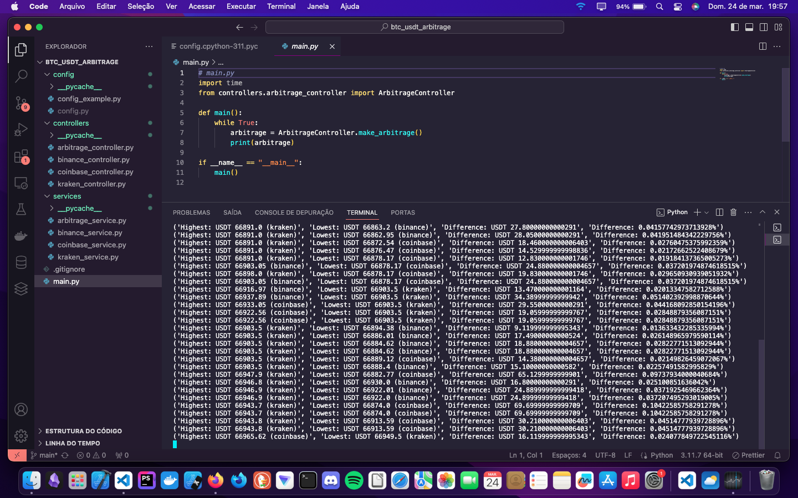

# BTC/USDT Arbitrage

This project provides a basic framework for exploring potential arbitrage opportunities between BTC/USDT trading pairs on different exchanges. Please note that this is a conceptual sketch and does not execute any actual trading operations. Instead, it calculates and displays the price differences between exchanges.

## Overview

Arbitrage trading involves exploiting price differences of the same asset across different markets or exchanges. While this script merely prints the price difference for BTC/USDT pairs, it serves as a starting point for understanding arbitrage strategies.

## Usage

Simply run the Python script to see the price difference printed to the console. Keep in mind that this is a passive script and does not execute any trades.

python3 main.py

## Notes

* Exchange Selection: This script currently focuses on specific exchanges and trading pairs. Feel free to customize it to fit your preferred exchanges or trading pairs.
* Performance Considerations: The efficiency of arbitrage strategies heavily depends on the speed of execution. While Python is used here for simplicity and readability, it may not be the ideal choice for high-frequency trading. For future projects requiring faster execution, I'll consider using languages like C++ or Go.

## Disclaimer

This project is provided for educational purposes only and should not be considered financial advice. Always conduct thorough research and exercise caution when engaging in trading activities.
